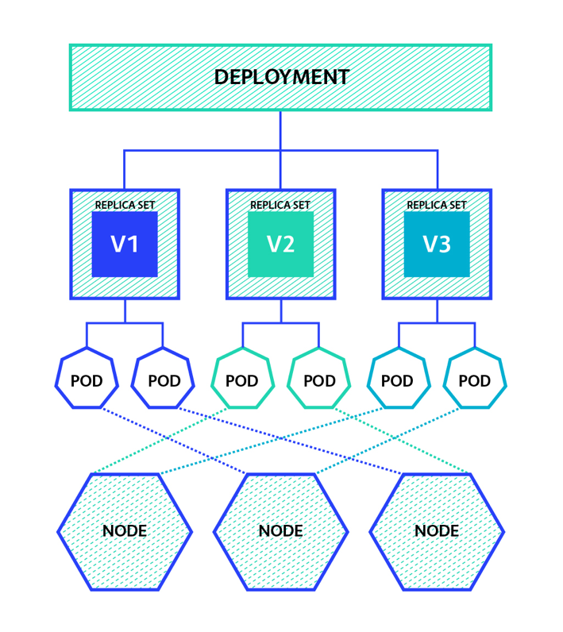

---

## Deployments

---

A **Deployment** creates **Pods** and defines which container image(s) to use within a Pod, how many replicas of the Pods to maintain, and configuration options for the Pod.
Kubernetes will maintain the health of the Pods deployed from the Deployment until the Deployment is deleted.
That means that if a Pod dies that is part of a Deployment, Kubernetes will stand up a new Pod to return to the desired number of Pods (specified in the Deployment).

---

## Preparing a YAML file for Kubernetes

YAML files are very particular about spacing. Always use the spaces to indent and never use tabs.

Review the contents of the file hello-deploy.yaml, which we will be using here in the next step.

`cat hello-deploy.yaml; echo;echo`{{execute}}

---

## Pushing a Deployment 

Now, we let's apply the hello-deploy.yaml file.

`kubectl apply -f hello-deploy.yaml`{{execute}}

> _"deployment.apps/a123456-hello created"_

Let's check the status of the deployment and pods with the command below. 

`kubectl -n default get all -l user=a123456`{{execute}}

_NOTE: In our example we are using a label 'user=a123456' (defined in our yaml) to get all resources associated with the deployment_

---

Notice that there is something called a **ReplicaSet**. Under the hood, a Deployment actually creates a ReplicaSet, which is responsible for maintaining the number of Pod replicas you specified in your Deployment.

---

## Kubernetes Logs

Before checking the logs, we will confirm that the Deployment is healthy.

`kubectl -n default wait deploy/a123456-hello --for=condition=available --timeout=120s`{{execute}}

You can use the kubectl logs command to view stdout (standard output) and stderr (standard error - error messages or diagnostics) from Pods.

`kubectl -n default logs deployment/a123456-hello --tail=10`{{execute}}

> _"Hello world!"_

Congrats! Your first Kubernetes Deployment is live!
