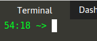

---

## Kubernetes Lab Intro

---

**WARNING - YOU HAVE LESS THAN 1 HOUR BEFORE YOUR SESSION EXPIRES!**

>Note the time left (in HH:MM) for the session, it is in your prompt and updated after every command run:

---

## Lab Overview

In this lab, we are going to:
- Deploy a **ConfigMap**
- Utilize the **ConfigMap** in a **Deployment**
- Update the **ConfigMap** 

Commands will look like this (click the line to execute the command):

`echo Hello`{{execute}}

Expected output will look like this:

> _"Hello"_

